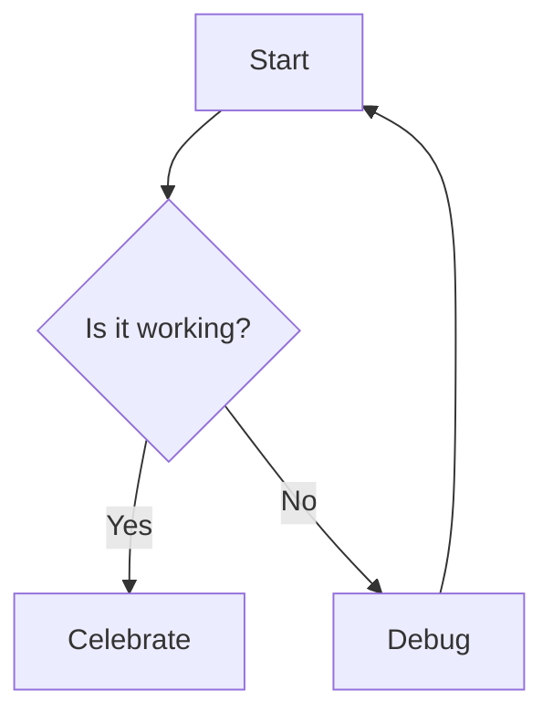
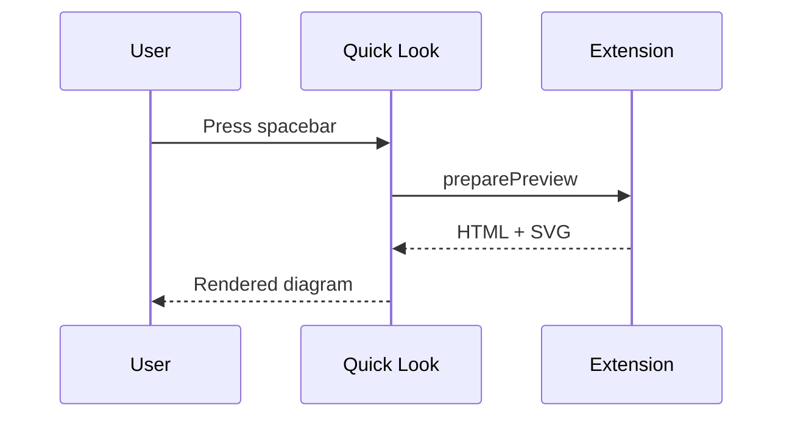

# Mermaid rendering smoke test

Three diagrams, one deliberately broken.

## Flowchart



## Sequence



## Broken (should show an error, not crash the preview)

```mermaid
this is not valid mermaid syntax at all
    --> nope
```

Regular prose after the diagrams should still render fine.
