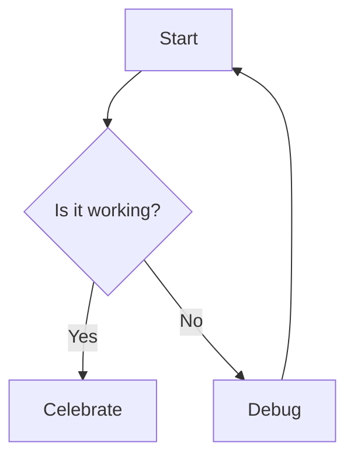
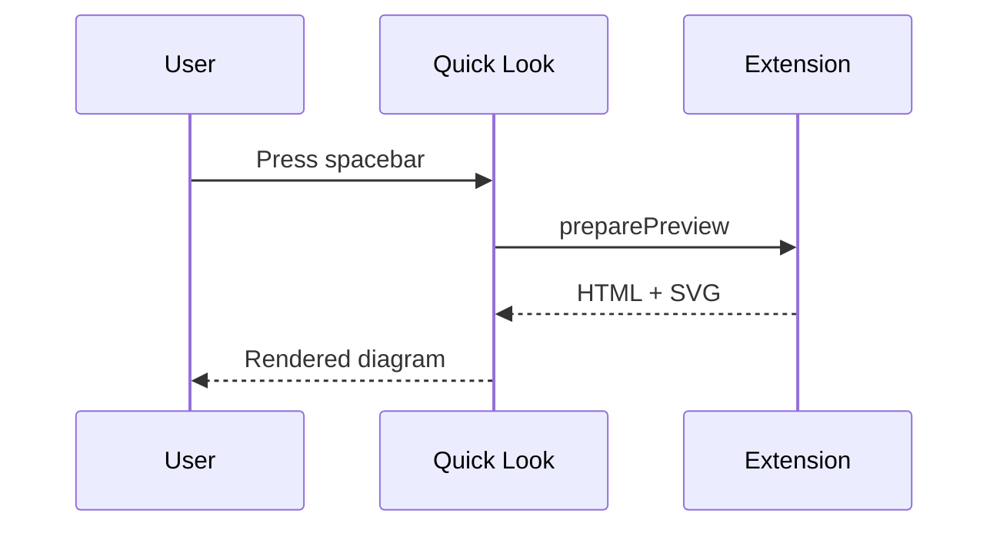

# Mermaid Local Rendering Implementation Plan

> **For agentic workers:** REQUIRED SUB-SKILL: Use superpowers:subagent-driven-development (recommended) or superpowers:executing-plans to implement this plan task-by-task. Steps use checkbox (`- [ ]`) syntax for tracking.

**Goal:** Render mermaid diagrams as inline SVG in the Quick Look preview, locally, without relaxing our strict CSP.

**Architecture:** Vendor a minimally-patched copy of `mermaid.min.js` (2 `Function("return this")` calls replaced with `globalThis`) into `Resources/`. When the rendered markdown contains one or more mermaid blocks, `HTMLConverter` emits a source placeholder, `HTMLTemplate` inlines the patched mermaid bundle + an init script under the existing nonce-based CSP, and the init script calls `mermaid.render(...)` to replace each placeholder with its SVG. Non-mermaid documents pay zero cost.

**Tech Stack:** Swift 5.9, swift-markdown, WKWebView (macOS 14+), mermaid.js 11.14.0 (patched), bash+curl+sed (vendor step).

**Assumed background for the engineer:**
- `Shared/` is compiled into three targets (app, Quick Look extension, tests) as source. Per-target `Resources/` is already configured in `project.yml`.
- CSS and small JS snippets currently live as Swift string constants in `HTMLTemplate.swift`. That pattern does NOT scale to a 3MB bundle — mermaid.js must be loaded from `Resources/` at runtime.
- Each target's resource lookup must use `Bundle(for: BundleLocator.self)` where `BundleLocator` is a private class local to the target. `Bundle.main` breaks in unit tests.
- Quick Look unit tests run via `xcrun xctest` (not `xcodebuild test`, which hangs on the GUI host) — see `CLAUDE.md`.
- The actual mermaid rendering (JavaScript executing inside WKWebView) cannot be tested in XCTest. Swift tests verify HTML/CSP structure; real rendering is verified by opening a test fixture in Safari (fast) and finally in Quick Look (slow, requires Xcode signing).
- Mermaid 11.14.0 upstream issue: https://github.com/mermaid-js/mermaid/issues/5378 / PR #5408. Both stalled. This plan is the workaround.

**Working branch:** Create and work on `feat/mermaid-local-render`. Do not commit to master directly. Do not create a worktree for this — the project is small and worktrees add friction here.

---

## File Structure

Files created or modified, grouped by responsibility:

**Vendored asset**
- Create: `Resources/mermaid.min.js` — patched mermaid 11.14.0 UMD bundle (~3 MB, committed to repo)
- Create: `Resources/mermaid-source.txt` — 1-line provenance file recording upstream URL + SHA + patch diff, for reproducibility

**Build tooling**
- Modify: `Makefile` — add `vendor-mermaid` target that fetches + patches + verifies

**Rendering**
- Modify: `Shared/HTMLConverter.swift:50-60` — change `visitCodeBlock` mermaid branch to emit a clean placeholder
- Modify: `Shared/HTMLTemplate.swift` — add `hasMermaid` parameter to `build(...)`, add lazy `mermaidScript` bundle-loaded constant, add `mermaidInitScript` Swift string constant, conditionally inject both, update `.mermaid-*` CSS
- Modify: `Shared/MarkdownRenderer.swift:15-22` — detect mermaid blocks, pass `hasMermaid` to `HTMLTemplate.build`

**Tests**
- Modify: `Tests/EdgeCaseTests.swift:263-284` — replace old styled-block assertions with placeholder-structure + injection assertions; add 4 new tests
- Create: `Tests/MermaidBundleTests.swift` — verifies the vendored `mermaid.min.js` loads from bundle, is non-empty, and contains no forbidden `Function("return this")` patterns

**Project wiring**
- Verify only (no change expected): `project.yml` — `Resources` path is already a resource for all three targets. After adding `mermaid.min.js`, re-run `xcodegen generate` and confirm the file appears in the built `.app` and `.appex`.

**Test fixture**
- Create: `TestFiles/mermaid-sample.md` — 3 diagrams (flowchart, sequence, invalid syntax) for manual verification in Safari and Quick Look

---

## Task 1: Vendor the patched mermaid.min.js

**Files:**
- Modify: `Makefile`
- Create: `Resources/mermaid.min.js`
- Create: `Resources/mermaid-source.txt`

This task establishes the reproducible build recipe and produces the patched file. All later tasks depend on this file existing in `Resources/`.

- [ ] **Step 1: Add `vendor-mermaid` Makefile target**

Open `Makefile`. Add this target above `clean:` and add it to the `.PHONY:` line.

```makefile
.PHONY: build test deploy release notarize clean vendor-mermaid

MERMAID_VERSION = 11.14.0
MERMAID_URL = https://unpkg.com/mermaid@$(MERMAID_VERSION)/dist/mermaid.min.js
MERMAID_DST = Resources/mermaid.min.js
MERMAID_PROV = Resources/mermaid-source.txt

vendor-mermaid:
	@echo "==> Fetching mermaid@$(MERMAID_VERSION)..."
	@curl -fsSL "$(MERMAID_URL)" -o /tmp/mermaid.raw.js
	@UPSTREAM_SHA=$$(shasum -a 256 /tmp/mermaid.raw.js | awk '{print $$1}'); \
	 echo "    upstream sha256: $$UPSTREAM_SHA"; \
	 COUNT=$$(grep -c 'Function("return this")' /tmp/mermaid.raw.js); \
	 if [ "$$COUNT" -lt 1 ]; then \
	   echo "ERROR: no Function(\"return this\") calls found — did upstream fix it? Check manually."; \
	   exit 1; \
	 fi; \
	 echo "    found $$COUNT Function(\"return this\") occurrences"; \
	 sed 's/Function("return this")()/globalThis/g; s/Function("return this")/(function(){return globalThis})/g' /tmp/mermaid.raw.js > "$(MERMAID_DST)"; \
	 REMAIN=$$(grep -c 'Function("return this")' "$(MERMAID_DST)" || true); \
	 if [ "$$REMAIN" != "0" ]; then \
	   echo "ERROR: $$REMAIN Function(\"return this\") calls remain after patch"; \
	   exit 1; \
	 fi; \
	 PATCHED_SHA=$$(shasum -a 256 "$(MERMAID_DST)" | awk '{print $$1}'); \
	 printf "source: %s\nupstream_sha256: %s\npatched_sha256: %s\npatch: sed 's/Function(\"return this\")()/globalThis/g; s/Function(\"return this\")/(function(){return globalThis})/g'\n" \
	   "$(MERMAID_URL)" "$$UPSTREAM_SHA" "$$PATCHED_SHA" > "$(MERMAID_PROV)"
	@rm -f /tmp/mermaid.raw.js
	@echo "==> Wrote $(MERMAID_DST) ($$(wc -c < $(MERMAID_DST) | tr -d ' ') bytes) + $(MERMAID_PROV)"
```

Note: the sed has TWO expressions because some bundlers emit `Function("return this")()` (self-invoked) and some emit `Function("return this")` (stored). The first replaces the invoked form with `globalThis` directly. The second handles any remaining bare form by wrapping in an arrow-equivalent. If neither form exists after patching, the final grep fails the build.

- [ ] **Step 2: Run the vendor target and inspect the output**

Run:
```bash
make vendor-mermaid
```

Expected output includes a line reporting a non-zero `Function("return this")` count pre-patch and success after. Then:
```bash
ls -lh Resources/mermaid.min.js
wc -c Resources/mermaid.min.js
grep -c 'Function("return this")' Resources/mermaid.min.js || echo "0 (expected)"
head -c 200 Resources/mermaid.min.js
cat Resources/mermaid-source.txt
```

Expected: file size ~2.8–3.2 MB. Zero `Function("return this")` occurrences. `head` shows mermaid's UMD header (starts with `(function(e,t){` or similar). `mermaid-source.txt` has upstream URL, two sha256s, and the patch string.

- [ ] **Step 3: Sanity-check in Safari (no Swift code involved yet)**

Create `/tmp/mermaid-smoketest.html`:
```bash
cat > /tmp/mermaid-smoketest.html <<'EOF'
<!DOCTYPE html><html><head>
<meta http-equiv="Content-Security-Policy" content="default-src 'none'; style-src 'unsafe-inline'; script-src 'nonce-abc'; img-src data:;">
<style>body{font-family:sans-serif;padding:2rem;}.m{margin:1rem 0;padding:1rem;border:1px solid #ccc;}</style>
</head><body>
<div class="m" id="d1">graph TD; A[Start] --> B{Go?}; B -->|Yes| C[Done]; B -->|No| A;</div>
<script nonce="abc">
// inline the patched bundle
EOF
cat Resources/mermaid.min.js >> /tmp/mermaid-smoketest.html
cat >> /tmp/mermaid-smoketest.html <<'EOF'
</script>
<script nonce="abc">
mermaid.initialize({ startOnLoad: false });
const el = document.getElementById('d1');
const src = el.textContent.trim();
mermaid.render('svg1', src).then(({svg}) => { el.innerHTML = svg; })
  .catch(e => { el.innerHTML = '<pre>'+e.message+'</pre>'; });
</script>
</body></html>
EOF
open -a Safari /tmp/mermaid-smoketest.html
```

Expected: Safari shows a rendered flowchart. Open the Web Inspector (⌘⌥I) → Console. Confirm **zero** `Content-Security-Policy` violations and **zero** `unsafe-eval` errors. If the diagram renders and the console is clean, the patch is correct. If you see a CSP error mentioning `eval` or `Function`, the patch missed an occurrence — grep the file for `Function(` and investigate.

- [ ] **Step 4: Commit vendored asset + Makefile changes**

```bash
git checkout -b feat/mermaid-local-render
git add Makefile Resources/mermaid.min.js Resources/mermaid-source.txt
git commit -m "Vendor patched mermaid.min.js 11.14.0 for CSP-safe rendering

Mermaid upstream still uses Function(\"return this\") via lodash-es
(issue #5378, PR #5408 stalled). Vendor a copy with 2 calls replaced
by globalThis so the bundle runs under our nonce-based CSP without
'unsafe-eval'. Makefile target 'vendor-mermaid' is reproducible.

Co-Authored-By: Claude Opus 4.6 (1M context) <noreply@anthropic.com>"
```

---

## Task 2: Verify the vendored bundle loads from Bundle at runtime

**Files:**
- Create: `Tests/MermaidBundleTests.swift`

Before touching the renderer, write a test that proves the vendored file is accessible via `Bundle(for:)` from the test target. This isolates bundle-wiring problems from rendering logic.

- [ ] **Step 1: Write the failing test**

Create `Tests/MermaidBundleTests.swift`:

```swift
import XCTest

final class MermaidBundleTests: XCTestCase {
    private final class BundleLocator {}

    func testMermaidBundleFileExists() {
        let bundle = Bundle(for: BundleLocator.self)
        let url = bundle.url(forResource: "mermaid.min", withExtension: "js")
        XCTAssertNotNil(url, "mermaid.min.js should be in the test target bundle")
    }

    func testMermaidBundleIsNonTrivial() throws {
        let bundle = Bundle(for: BundleLocator.self)
        guard let url = bundle.url(forResource: "mermaid.min", withExtension: "js") else {
            XCTFail("mermaid.min.js missing from bundle")
            return
        }
        let data = try Data(contentsOf: url)
        XCTAssertGreaterThan(data.count, 1_000_000, "mermaid.min.js should be at least 1 MB")
        XCTAssertLessThan(data.count, 10_000_000, "mermaid.min.js should be under 10 MB")
    }

    func testMermaidBundleHasNoForbiddenFunctionCalls() throws {
        let bundle = Bundle(for: BundleLocator.self)
        guard let url = bundle.url(forResource: "mermaid.min", withExtension: "js"),
              let js = try? String(contentsOf: url, encoding: .utf8) else {
            XCTFail("mermaid.min.js unreadable")
            return
        }
        XCTAssertFalse(js.contains("Function(\"return this\")"),
                       "Patched mermaid.min.js must not contain Function(\"return this\")")
    }
}
```

- [ ] **Step 2: Run the test — expect it to fail because xcodegen hasn't been re-run**

```bash
xcodegen generate
xcodebuild -project PreviewMD.xcodeproj -scheme PreviewMD -configuration Debug -derivedDataPath build build-for-testing CODE_SIGN_IDENTITY="" CODE_SIGNING_REQUIRED=NO CODE_SIGNING_ALLOWED=NO 2>&1 | tail -5
xcrun xctest -XCTest MermaidBundleTests build/Build/Products/Debug/PreviewMDTests.xctest
```

Expected: either build failure (test file not yet in project — re-run `xcodegen generate` which should pick it up from `Tests/`) or all three tests pass if `xcodegen` already wired it. If tests fail with "mermaid.min.js missing from bundle", re-check `project.yml` — `Resources` should already be listed for `PreviewMDTests` (verify by reading `project.yml` around `targets: PreviewMDTests:`). If it is and the file still isn't found, check that `Resources/mermaid.min.js` was actually committed in Task 1.

- [ ] **Step 3: Confirm all three tests pass**

Re-run the xctest command from Step 2. Expected: 3 tests pass. If any fail, stop and debug bundle wiring — do not proceed to Task 3.

- [ ] **Step 4: Commit**

```bash
git add Tests/MermaidBundleTests.swift PreviewMD.xcodeproj
git commit -m "Add MermaidBundleTests: verify vendored mermaid.min.js loads from bundle

Co-Authored-By: Claude Opus 4.6 (1M context) <noreply@anthropic.com>"
```

---

## Task 3: Update HTMLConverter to emit a placeholder for mermaid blocks

**Files:**
- Modify: `Shared/HTMLConverter.swift:50-60`
- Modify: `Tests/EdgeCaseTests.swift:263-284`

Current behavior (HTMLConverter.swift:53-54): mermaid fenced blocks emit a styled `<div class="mermaid-block"><div class="mermaid-header">...</div><pre><code>...source...</code></pre></div>`. We need a cleaner structure the init JS can find and replace: `<div class="mermaid-block" data-mermaid-src="...escaped source..."></div>`. The source goes in a data attribute so the JS can read it without text-node parsing, and the empty div becomes the SVG target.

The escaped-HTML data-attribute form is safe: `data-mermaid-src` is read via `dataset.mermaidSrc` in JS, which returns the decoded-once string, ready to hand to `mermaid.render`.

- [ ] **Step 1: Update the three existing mermaid tests in EdgeCaseTests.swift to describe the new behavior**

Open `Tests/EdgeCaseTests.swift`. Replace lines 263–284 with:

```swift
    // MARK: - Mermaid blocks

    func testMermaidBlockEmitsPlaceholderWithDataAttr() {
        let input = "```mermaid\ngraph TD;\n  A-->B;\n```"
        let html = MarkdownRenderer.render(input)
        XCTAssertTrue(html.contains("class=\"mermaid-block\""),
                      "Mermaid block should use .mermaid-block container")
        XCTAssertTrue(html.contains("data-mermaid-src=\""),
                      "Mermaid block should carry source in data-mermaid-src")
        XCTAssertTrue(html.contains("graph TD;"),
                      "Mermaid source must be preserved (HTML-escaped) in the data attribute")
    }

    func testMermaidSourceIsHTMLEscapedInDataAttribute() {
        let input = "```mermaid\ngraph LR; A-->B & \"C\"\n```"
        let html = MarkdownRenderer.render(input)
        XCTAssertTrue(html.contains("A--&gt;B &amp; &quot;C&quot;"),
                      "Mermaid source must be HTML-escaped inside data-mermaid-src")
        XCTAssertFalse(html.contains("data-mermaid-src=\"graph LR; A-->B & \"C\""),
                       "Unescaped quotes would break the attribute")
    }

    func testMermaidDoesNotEmitLegacyHeader() {
        let input = "```mermaid\ngraph TD;\n```"
        let html = MarkdownRenderer.render(input)
        XCTAssertFalse(html.contains("mermaid-header"),
                       "Old 'mermaid-header' div should be gone — init JS handles labeling")
        XCTAssertFalse(html.contains("Mermaid Diagram"),
                       "Old header text should be gone")
    }

    func testMermaidDoesNotGetLanguageClass() {
        let input = "```mermaid\ngraph TD;\n```"
        let html = MarkdownRenderer.render(input)
        XCTAssertFalse(html.contains("language-mermaid"),
                       "Mermaid should not get generic language class")
    }

    func testRegularCodeBlockUnaffected() {
        let input = "```python\nprint('hi')\n```"
        let html = MarkdownRenderer.render(input)
        XCTAssertFalse(html.contains("mermaid-block"),
                       "Python block must not be wrapped in mermaid container")
        XCTAssertTrue(html.contains("<pre><code class=\"language-python\""),
                      "Regular code keeps its language class")
    }
```

- [ ] **Step 2: Run tests to confirm they fail against the old converter**

```bash
xcrun xctest -XCTest EdgeCaseTests/testMermaidBlockEmitsPlaceholderWithDataAttr build/Build/Products/Debug/PreviewMDTests.xctest
```

Expected: FAIL. The old converter does not emit `data-mermaid-src`. (If the build hasn't been rebuilt since last task, run `xcodebuild ... build-for-testing` first — see Task 2 Step 2 for the full command.)

- [ ] **Step 3: Update HTMLConverter.swift mermaid branch**

Open `Shared/HTMLConverter.swift`. Replace the existing `visitCodeBlock` body (lines 50–60):

```swift
    mutating func visitCodeBlock(_ codeBlock: CodeBlock) -> String {
        let escaped = escapeHTML(codeBlock.code)
        if let lang = codeBlock.language, !lang.isEmpty {
            if lang.lowercased() == "mermaid" {
                return "<div class=\"mermaid-block\" data-mermaid-src=\"\(escaped)\"></div>\n"
            }
            let s = escapeHTML(lang)
            return "<pre><code class=\"language-\(s)\" data-lang=\"\(s)\">\(escaped)</code></pre>\n"
        }
        return "<pre><code>\(escaped)</code></pre>\n"
    }
```

Verify `HTMLUtils.escapeHTML` escapes `&`, `<`, `>`, `"`, and `'` — all five are required for safe use inside a double-quoted attribute. If it does not escape `"`, stop and fix `HTMLUtils.escapeHTML` first (it would be a pre-existing bug). Check with:

```bash
grep -n 'escapeHTML' Shared/HTMLUtils.swift
```

- [ ] **Step 4: Rebuild and re-run the mermaid tests**

```bash
xcodebuild -project PreviewMD.xcodeproj -scheme PreviewMD -configuration Debug -derivedDataPath build build-for-testing CODE_SIGN_IDENTITY="" CODE_SIGNING_REQUIRED=NO CODE_SIGNING_ALLOWED=NO 2>&1 | tail -3
xcrun xctest -XCTest EdgeCaseTests build/Build/Products/Debug/PreviewMDTests.xctest 2>&1 | grep -E 'Mermaid|passed|failed'
```

Expected: all 5 mermaid tests pass. If `testMermaidSourceIsHTMLEscapedInDataAttribute` fails, the escapeHTML function is not escaping quotes — fix that first.

- [ ] **Step 5: Run the full test suite to catch regressions**

```bash
xcrun xctest build/Build/Products/Debug/PreviewMDTests.xctest 2>&1 | tail -5
```

Expected: zero failures. If any `RenderOutputTest` snapshot-style tests reference the old `mermaid-header` text, update those fixtures too — search with:

```bash
grep -rn 'mermaid-header\|Mermaid Diagram' Tests/
```

- [ ] **Step 6: Commit**

```bash
git add Shared/HTMLConverter.swift Tests/EdgeCaseTests.swift
git commit -m "Emit mermaid blocks as empty placeholder divs with data-mermaid-src

The init script (next commit) will read dataset.mermaidSrc and replace
the div contents with rendered SVG. Removes the 'Mermaid Diagram' header
since the SVG will speak for itself.

Co-Authored-By: Claude Opus 4.6 (1M context) <noreply@anthropic.com>"
```

---

## Task 4: Conditionally inject mermaid.js + init script in HTMLTemplate

**Files:**
- Modify: `Shared/HTMLTemplate.swift`

`HTMLTemplate.build(...)` currently takes only `frontmatter` and `content`. Extend it to take `hasMermaid: Bool` and, when true, inline the bundle-loaded mermaid.min.js plus a small init script under the existing script-src nonce. When false, emit nothing extra (non-mermaid docs pay no cost).

- [ ] **Step 1: Add a BundleLocator + lazy mermaidScript constant**

Open `Shared/HTMLTemplate.swift`. Immediately before `enum HTMLTemplate {`, add:

```swift
private final class HTMLTemplateBundleLocator {}
```

Inside the enum, at the very top (above `static func build`), add:

```swift
    static let mermaidScript: String = {
        let bundle = Bundle(for: HTMLTemplateBundleLocator.self)
        guard let url = bundle.url(forResource: "mermaid.min", withExtension: "js"),
              let data = try? Data(contentsOf: url),
              let str = String(data: data, encoding: .utf8) else {
            return ""
        }
        return str
    }()
```

This is a `static let` closure — evaluated once per process, on first access. The 3MB string stays in memory for the lifetime of the extension (one preview process), and is reused across renders.

- [ ] **Step 2: Add the mermaid init script constant**

Inside the enum, after `autolinkScript`, add:

```swift
    // MARK: - Mermaid Init Script

    static let mermaidInitScript = """
    (function() {
        if (typeof mermaid === 'undefined') return;
        var dark = window.matchMedia && window.matchMedia('(prefers-color-scheme: dark)').matches;
        mermaid.initialize({
            startOnLoad: false,
            securityLevel: 'strict',
            theme: dark ? 'dark' : 'default',
            fontFamily: '-apple-system, sans-serif'
        });
        var blocks = document.querySelectorAll('.mermaid-block[data-mermaid-src]');
        blocks.forEach(function(el, i) {
            var src = el.dataset.mermaidSrc;
            try {
                mermaid.render('mermaid-svg-' + i, src).then(function(result) {
                    el.innerHTML = result.svg;
                    el.removeAttribute('data-mermaid-src');
                }).catch(function(err) {
                    el.innerHTML = '<div class="mermaid-error"><strong>Mermaid error:</strong> ' +
                        (err && err.message ? err.message : String(err)) +
                        '</div><pre>' +
                        src.replace(/&/g,'&amp;').replace(/</g,'&lt;').replace(/>/g,'&gt;') +
                        '</pre>';
                });
            } catch (err) {
                el.innerHTML = '<div class="mermaid-error"><strong>Mermaid error:</strong> ' +
                    (err && err.message ? err.message : String(err)) + '</div>';
            }
        });
    })();
    """
```

Notes: `securityLevel: 'strict'` disables clickable links and HTML in labels — appropriate for a Quick Look preview of untrusted files. `mermaid.render` is async (returns a Promise); we call `.then` / `.catch`. Errors are rendered inline so one broken diagram doesn't kill the others or blank the preview.

- [ ] **Step 3: Update `build(...)` signature and body**

Replace the current `build(frontmatter:content:)` function (HTMLTemplate.swift:4-30) with:

```swift
    static func build(frontmatter: String, content: String, hasMermaid: Bool = false) -> String {
        let nonce = generateNonce()
        let mermaidTag: String
        if hasMermaid && !mermaidScript.isEmpty {
            mermaidTag = """
            <script nonce="\(nonce)">
            \(mermaidScript)
            </script>
            <script nonce="\(nonce)">
            \(mermaidInitScript)
            </script>
            """
        } else {
            mermaidTag = ""
        }
        return """
        <!DOCTYPE html>
        <html>
        <head>
        <meta charset="utf-8">
        <meta http-equiv="Content-Security-Policy" content="default-src 'none'; style-src 'unsafe-inline'; script-src 'nonce-\(nonce)'; img-src file: data:;">
        <style>
        \(css)
        </style>
        </head>
        <body>
        \(frontmatter)
        <article class="markdown-body">
        \(content)
        </article>
        <script nonce="\(nonce)">
        \(highlightScript)
        \(autolinkScript)
        document.body.setAttribute('tabindex', '0');
        document.body.focus();
        </script>
        \(mermaidTag)
        </body>
        </html>
        """
    }
```

The `hasMermaid: Bool = false` default keeps all existing call sites (tests) source-compatible.

- [ ] **Step 4: Update mermaid CSS block in HTMLTemplate.swift**

Replace the existing `.mermaid-*` CSS (HTMLTemplate.swift lines 413–431) with:

```css
    /* Mermaid diagrams */
    .mermaid-block {
        margin: 1em 0;
        padding: 16px;
        background: var(--bg-secondary);
        border: 1px solid var(--border);
        border-radius: 8px;
        text-align: center;
        overflow-x: auto;
    }
    .mermaid-block[data-mermaid-src]::before {
        content: "Rendering diagram…";
        color: var(--text-secondary);
        font-size: 13px;
        font-style: italic;
    }
    .mermaid-block svg {
        max-width: 100%;
        height: auto;
    }
    .mermaid-error {
        color: var(--badge-red-text);
        background: var(--badge-red-bg);
        padding: 8px 12px;
        border-radius: 4px;
        text-align: left;
        font-size: 13px;
        margin-bottom: 8px;
    }
    .mermaid-error + pre {
        text-align: left;
        background: var(--bg);
        border: 1px solid var(--border);
        border-radius: 4px;
        padding: 8px 12px;
        font-size: 12px;
        overflow-x: auto;
    }
```

The `[data-mermaid-src]::before` shows a "Rendering diagram…" placeholder until the JS removes the attribute after successful render — visual feedback while mermaid parses.

- [ ] **Step 5: Write tests for the new build signature**

Append to `Tests/EdgeCaseTests.swift` (at the end of the class, before the closing brace):

```swift
    // MARK: - Mermaid injection in HTMLTemplate

    func testTemplateOmitsMermaidScriptWhenNoDiagrams() {
        let html = HTMLTemplate.build(frontmatter: "", content: "<p>hi</p>")
        XCTAssertFalse(html.contains("mermaid.initialize"),
                       "Plain docs must not ship the mermaid bundle")
        // NB: use trailing `="` to distinguish the real attribute from the
        // CSS selector `.mermaid-block[data-mermaid-src]::before` which also
        // contains the substring `data-mermaid-src` and is always in the template.
        XCTAssertFalse(html.contains("data-mermaid-src=\""),
                       "Plain docs have no mermaid placeholder divs")
    }

    func testTemplateInjectsMermaidScriptWhenHasMermaid() {
        let html = HTMLTemplate.build(frontmatter: "", content: "<div class=\"mermaid-block\" data-mermaid-src=\"graph TD\"></div>", hasMermaid: true)
        XCTAssertTrue(html.contains("mermaid.initialize"),
                      "hasMermaid=true must inject init script")
        XCTAssertTrue(html.contains("mermaid-svg-"),
                      "init script must reference mermaid-svg- id prefix")
    }

    func testTemplateMermaidScriptIsLargeEnough() {
        XCTAssertGreaterThan(HTMLTemplate.mermaidScript.count, 1_000_000,
                             "Vendored mermaid.min.js must be at least 1 MB when loaded")
    }

    func testTemplateCSPStillForbidsUnsafeEval() {
        let html = HTMLTemplate.build(frontmatter: "", content: "<div class=\"mermaid-block\" data-mermaid-src=\"graph TD\"></div>", hasMermaid: true)
        XCTAssertFalse(html.contains("'unsafe-eval'"),
                       "CSP must never include unsafe-eval")
        XCTAssertTrue(html.contains("script-src 'nonce-"),
                      "CSP must still use nonce-based script-src")
    }
```

- [ ] **Step 6: Rebuild and run the new tests**

```bash
xcodebuild -project PreviewMD.xcodeproj -scheme PreviewMD -configuration Debug -derivedDataPath build build-for-testing CODE_SIGN_IDENTITY="" CODE_SIGNING_REQUIRED=NO CODE_SIGNING_ALLOWED=NO 2>&1 | tail -3
xcrun xctest -XCTest EdgeCaseTests build/Build/Products/Debug/PreviewMDTests.xctest 2>&1 | grep -E 'Template|passed|failed'
```

Expected: all 4 new template tests pass. If `testTemplateMermaidScriptIsLargeEnough` fails, the bundle isn't loading — check Task 2 passed and that `HTMLTemplateBundleLocator` is in the same target compile unit as the bundle.

- [ ] **Step 7: Run the full test suite**

```bash
xcrun xctest build/Build/Products/Debug/PreviewMDTests.xctest 2>&1 | tail -5
```

Expected: zero failures across all test classes.

- [ ] **Step 8: Commit**

```bash
git add Shared/HTMLTemplate.swift Tests/EdgeCaseTests.swift
git commit -m "Inject mermaid.js from bundle + init script when document has diagrams

HTMLTemplate.build gains hasMermaid parameter (defaults to false for
compat). When true, inlines the vendored patched mermaid.min.js plus
a small init script that replaces each .mermaid-block with SVG. CSP
unchanged — still nonce-based, no unsafe-eval.

Co-Authored-By: Claude Opus 4.6 (1M context) <noreply@anthropic.com>"
```

---

## Task 5: Wire MarkdownRenderer to detect mermaid and set the flag

**Files:**
- Modify: `Shared/MarkdownRenderer.swift:15-22`
- Modify: `Tests/EdgeCaseTests.swift`

`MarkdownRenderer.render(_ input:)` currently builds the template unconditionally. Add a walk of the parsed document to detect whether any `CodeBlock` has language "mermaid", and pass that as `hasMermaid` to the template.

- [ ] **Step 1: Write the failing integration test**

Append to `Tests/EdgeCaseTests.swift` before the closing brace:

```swift
    func testRendererInjectsMermaidBundleWhenDocumentHasMermaid() {
        let input = "# Hi\n\n```mermaid\ngraph TD; A-->B\n```\n"
        let html = MarkdownRenderer.render(input)
        XCTAssertTrue(html.contains("mermaid.initialize"),
                      "Renderer must trip hasMermaid when a mermaid block is present")
    }

    func testRendererOmitsMermaidBundleForPlainDoc() {
        let input = "# Hi\n\n```python\nprint('hi')\n```\n"
        let html = MarkdownRenderer.render(input)
        XCTAssertFalse(html.contains("mermaid.initialize"),
                       "Renderer must not inject mermaid bundle when no mermaid block")
    }
```

- [ ] **Step 2: Rebuild and run — expect failure**

```bash
xcodebuild -project PreviewMD.xcodeproj -scheme PreviewMD -configuration Debug -derivedDataPath build build-for-testing CODE_SIGN_IDENTITY="" CODE_SIGNING_REQUIRED=NO CODE_SIGNING_ALLOWED=NO 2>&1 | tail -3
xcrun xctest -XCTest EdgeCaseTests/testRendererInjectsMermaidBundleWhenDocumentHasMermaid build/Build/Products/Debug/PreviewMDTests.xctest
```

Expected: FAIL — `MarkdownRenderer.render` still passes `hasMermaid: false` (the default).

- [ ] **Step 3: Add a mermaid-detection walker and wire it in**

Open `Shared/MarkdownRenderer.swift`. Replace `render(_ input:)` (lines 12–22) with:

```swift
    static func render(_ input: String) -> String {
        let parsed = FrontmatterParser.parse(input)
        let frontmatterHTML = renderFrontmatter(parsed.frontmatter)
        let document = Document(parsing: parsed.content)
        let hasMermaid = documentHasMermaid(document)
        var converter = HTMLConverter()
        let contentHTML = converter.visit(document)
        return HTMLTemplate.build(frontmatter: frontmatterHTML, content: contentHTML, hasMermaid: hasMermaid)
    }

    private static func documentHasMermaid(_ markup: any Markup) -> Bool {
        if let code = markup as? CodeBlock, code.language?.lowercased() == "mermaid" {
            return true
        }
        for child in markup.children {
            if documentHasMermaid(child) { return true }
        }
        return false
    }
```

Short-circuit recursion: returns as soon as the first mermaid block is found.

- [ ] **Step 4: Rebuild and run the two new tests**

```bash
xcodebuild -project PreviewMD.xcodeproj -scheme PreviewMD -configuration Debug -derivedDataPath build build-for-testing CODE_SIGN_IDENTITY="" CODE_SIGNING_REQUIRED=NO CODE_SIGNING_ALLOWED=NO 2>&1 | tail -3
xcrun xctest -XCTest EdgeCaseTests build/Build/Products/Debug/PreviewMDTests.xctest 2>&1 | grep -E 'Renderer|passed|failed'
```

Expected: both pass.

- [ ] **Step 5: Run the full suite + performance test to confirm no regressions**

```bash
xcrun xctest build/Build/Products/Debug/PreviewMDTests.xctest 2>&1 | tail -10
```

Expected: zero failures. Performance tests should still finish in their existing budget (detection is a linear walk — negligible compared to parsing).

- [ ] **Step 6: Commit**

```bash
git add Shared/MarkdownRenderer.swift Tests/EdgeCaseTests.swift
git commit -m "Detect mermaid blocks in MarkdownRenderer and pass hasMermaid flag

Recursive walk of the parsed Markdown AST short-circuits on first
mermaid CodeBlock. Plain documents continue to skip the 3MB bundle.

Co-Authored-By: Claude Opus 4.6 (1M context) <noreply@anthropic.com>"
```

---

## Task 6: Manual end-to-end verification in Safari (fast) then Quick Look

**Files:**
- Create: `TestFiles/mermaid-sample.md`

Swift unit tests cannot prove mermaid actually renders — they only prove the HTML has the right structure. This task produces visual evidence in two environments.

- [ ] **Step 1: Create the sample fixture**

Create `TestFiles/mermaid-sample.md`:

````markdown
---
title: Mermaid Sample
status: test
---

# Mermaid rendering smoke test

Three diagrams, one deliberately broken.

## Flowchart



## Sequence



## Broken (should show an error, not crash the preview)

```mermaid
this is not valid mermaid syntax at all
    --> nope
```

Regular prose after the diagrams should still render fine.
````

- [ ] **Step 2: Render the fixture HTML to /tmp and open in Safari**

Add a temporary Swift test or use the existing `MarkdownRenderer` via a one-shot script. The simplest path is a one-off xctest:

Append to `Tests/EdgeCaseTests.swift` temporarily (this test will stay — it's a useful regression test for the full fixture):

```swift
    func testMermaidSampleFixtureRendersToHTMLAndWritesToTmp() throws {
        let fixture = """
        # Mermaid rendering smoke test

        ```mermaid
        graph TD
            A[Start] --> B{Go?}
            B -->|Yes| C[Done]
        ```
        """
        let html = MarkdownRenderer.render(fixture)
        XCTAssertTrue(html.contains("mermaid.initialize"))
        // Write to /tmp so we can open it in Safari manually
        let url = URL(fileURLWithPath: "/tmp/previewmd-mermaid-out.html")
        try html.write(to: url, atomically: true, encoding: .utf8)
        print("WROTE: \(url.path)")
    }
```

Run:
```bash
xcodebuild -project PreviewMD.xcodeproj -scheme PreviewMD -configuration Debug -derivedDataPath build build-for-testing CODE_SIGN_IDENTITY="" CODE_SIGNING_REQUIRED=NO CODE_SIGNING_ALLOWED=NO 2>&1 | tail -3
xcrun xctest -XCTest EdgeCaseTests/testMermaidSampleFixtureRendersToHTMLAndWritesToTmp build/Build/Products/Debug/PreviewMDTests.xctest
open -a Safari /tmp/previewmd-mermaid-out.html
```

**Manual verification (do not proceed until all pass):**
- [ ] A flowchart diagram is visible (boxes, arrows, labels)
- [ ] Open Safari Web Inspector (⌘⌥I) → Console tab
- [ ] Zero CSP violation errors
- [ ] Zero `unsafe-eval` errors
- [ ] Zero `ReferenceError` / `TypeError` related to mermaid
- [ ] Toggle macOS appearance (System Settings → Appearance) and reload — diagram re-theme to dark is nice-to-have but not blocking (Quick Look overrides theme handling anyway)

If any check fails: **stop and diagnose**. Common failures and fixes:
- "Refused to execute script because of nonce/eval" → the patch missed an occurrence. Re-run `make vendor-mermaid` and grep the output for `Function(`, `eval(`, `new Function` — any hit needs another sed expression.
- "mermaid is not defined" → script tag didn't load. Inspect the HTML source in /tmp and confirm the `<script nonce="...">` tag is present and contains mermaid's UMD header.
- Diagram renders but looks broken → try a simpler diagram first to isolate mermaid DSL issues from our integration.

- [ ] **Step 3: Build and deploy to real Quick Look**

```bash
make sign
make deploy
```

`make deploy` installs to /Applications and resets Quick Look. Then in Finder, navigate to `TestFiles/mermaid-sample.md` and press spacebar.

**Manual verification:**
- [ ] Quick Look preview window shows the three diagrams (two rendered, one error)
- [ ] The broken diagram shows a `.mermaid-error` message with the mermaid parse error, not a blank/crashed preview
- [ ] Rest of the document (headings, text) renders normally alongside the diagrams
- [ ] No visible "Rendering diagram…" placeholder lingers after successful renders (the `::before` should disappear when JS removes the `data-mermaid-src` attribute)
- [ ] Open a non-mermaid markdown file (e.g. `README.md`) — it should preview instantly with no visible regression

If Quick Look fails to load the extension or the preview is blank, check Console.app for logs from `PreviewMDQuickLook` — common causes: signing mismatch, missing entitlement, or the resource didn't make it into the .appex (verify with `ls /Applications/PreviewMD.app/Contents/PlugIns/PreviewMDQuickLook.appex/Contents/Resources/mermaid.min.js`).

- [ ] **Step 4: Commit the fixture and the fixture test**

```bash
git add TestFiles/mermaid-sample.md Tests/EdgeCaseTests.swift
git commit -m "Add mermaid-sample.md fixture and end-to-end render smoke test

Test writes rendered HTML to /tmp/previewmd-mermaid-out.html for
manual Safari inspection. Fixture is used for manual Quick Look
verification — three diagrams including one with intentionally
broken syntax to prove error handling.

Co-Authored-By: Claude Opus 4.6 (1M context) <noreply@anthropic.com>"
```

---

## Task 7: Close out — docket, VISION.md, and squash/merge decision

**Files:**
- Modify: `VISION.md` (if it lists mermaid as a TODO)
- Update: docket (via `docket complete` CLI)

- [ ] **Step 1: Update docket**

The todo "Add Mermaid diagram support" (id `5852a4b33e794f1288fab`) is now complete. Mark it:

```bash
docket complete 5852a4b33e794f1288fab
docket list
```

Expected: the mermaid todo is gone / marked done. LaTeX, standalone viewer, inline commenting remain.

- [ ] **Step 2: Review and update VISION.md**

```bash
grep -n -i 'mermaid' VISION.md
```

If mermaid is listed as "planned" or "TODO", change it to shipped/done to match the other V1 features. If there's a differentiators or features list, mermaid local rendering is worth mentioning ("renders mermaid diagrams locally under strict CSP, no network"). Keep the edit minimal — one or two bullet points, matching the existing style.

- [ ] **Step 3: Review the branch critically (self-review, not a subagent)**

```bash
git log master..feat/mermaid-local-render --oneline
git diff master..feat/mermaid-local-render --stat
```

Ask yourself:
- Is the CSP still nonce-based with no `unsafe-eval`? (`grep -n 'Content-Security-Policy' Shared/HTMLTemplate.swift`)
- Do non-mermaid documents pay any cost? (No `mermaid.initialize` in their HTML — the unit test guards this, but eyeball one real rendered output to confirm.)
- Does `mermaid.min.js` contain any remaining `Function("return this")` or `eval(` patterns? (`grep -c 'Function("return this")\|eval(' Resources/mermaid.min.js` — eval hits inside strings/comments are fine; only top-level ones would execute.)
- Does the broken-diagram test case produce a visible error and let the other diagrams render? (Manually verified in Task 6.)

- [ ] **Step 4: Open a PR or merge to master**

Ask the user which they prefer. If merging directly:

```bash
git checkout master
git merge --no-ff feat/mermaid-local-render
```

If opening a PR, the user should run `gh pr create` themselves or instruct you to.

- [ ] **Step 5: Post-merge sanity check**

```bash
make clean && make build && make test
```

Expected: build succeeds, all tests pass on master.

---

## Self-Review Checklist (completed before saving this plan)

1. **Spec coverage:** Covers vendor step, bundle load, converter change, template injection, renderer detection, CSS, unit tests, manual Safari verification, manual Quick Look verification, error path, docket closeout, VISION update. ✓
2. **Placeholder scan:** No "TBD", no "add appropriate error handling", no "similar to Task N". Every code block is complete. ✓
3. **Type consistency:** `hasMermaid` is `Bool` with default `false` everywhere it appears (HTMLTemplate.build signature, call site in MarkdownRenderer, tests). `data-mermaid-src` attribute name is consistent across HTMLConverter, init script, CSS, and tests. `mermaid-block` class is consistent. `mermaid-error` class is consistent between init script and CSS. `HTMLTemplateBundleLocator` class name is used in one place only. ✓
4. **Known risk not mitigated:** we bundle 3MB in the extension `.appex`, growing it from ~500KB to ~3.5MB. Acceptable given this is a local app, not a downloaded extension. If install size becomes a concern, a follow-up could gzip the bundle and `atob()` at runtime — but this is premature optimization for v1.
